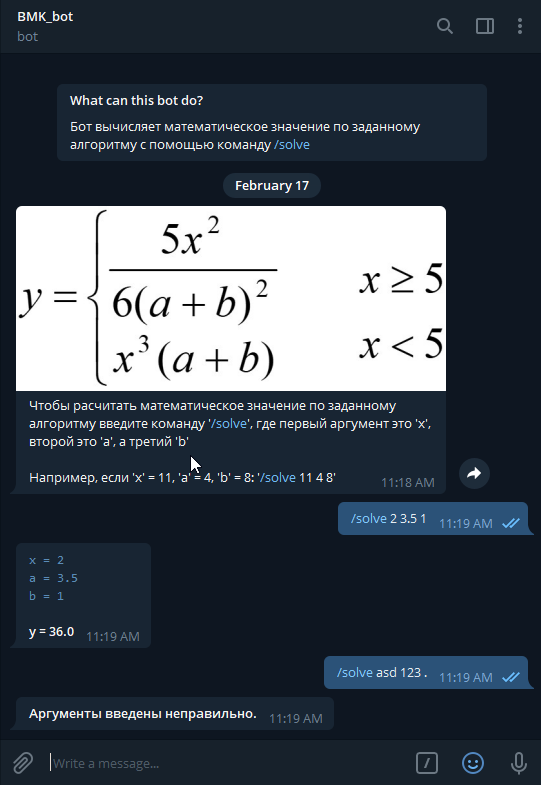

# BMK01_Telegram_Bot
## Разработка многоуровневых приложений

Разработка чат-бота Telegram на Java для расчета математического значения по заданному алгоритму.  
Серверная часть бота сделана с графическим интерфейсом для запуска и остановки бота.
 Лабораторная работа №2
 Вариант - 1  
  
Интерфейс управления  
  
Описание бота  
  
Бот в действии  
  
